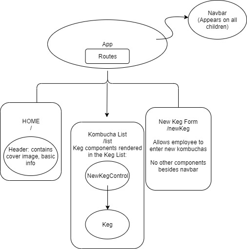

# _Anita Kemp's Kombucha Tap Room_

#### _An app that allows the user to track inventory as part of this week's code review at Epicodus, 11/15/2019 and 11/22/2019._

#### By _Anita Kemp_

## Description

This application will allow a patron to see what the current list of kombucha's availabale are, and for an employee to add a kombucha to the list. 

## Component Diagram

## Setup/Installation Requirements

* _Clone this repository_
* _Run npm install_
* _Then run npm run start_ 
* _Navigate to the localhost:8080_

## Support and contact details

_Please leave a comment on this repository if there are any questions._

## Technologies Used

_React, Html, Css_

### License

*MIT*

Copyright (c) 2019 **_Anita Kemp_**